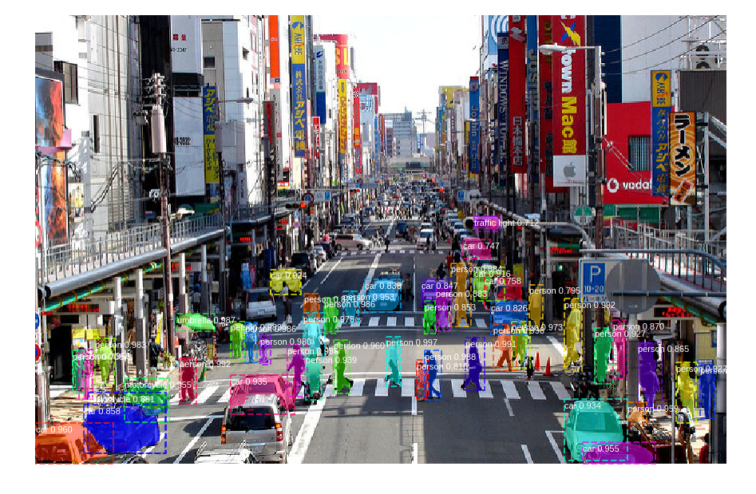
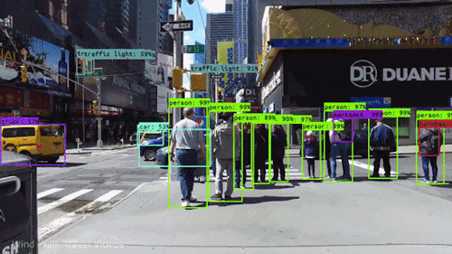
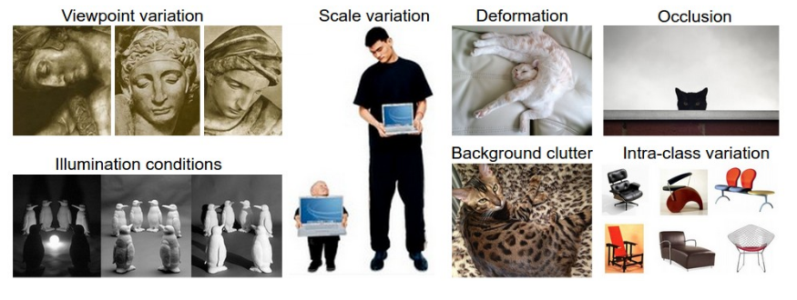

# [Object Detection Part 1: Basic Concepts](#Object Detection Part 1: Basic Concepts)

Let's take a look at what object detection is expected to solve first. 

> Object detection deals with detecting instances of semantic objects of a certain class (such as humans, buildings, or cars) in digital images and videos.

*Fig. 1. An example of object detection. (source: [link]())* 

As defined, object detection is expected to identify the instances of semantic objects and localize them in digital images and videos. Naturally, we expect the computer to  firstly detect whether an instance occurs on the image, if then predict the localization of the detected object, normally with a bounding box. 

Object detection as an essential computer vision branch has a variety of applications in real world. Facebook detects our faces when we or our friends upload a photo containing our faces, which is in fact achieved by the face detection. Autonomous car identifies pedestrians who are crossing the road, which is based on the pedestrian detection. Also, object detection has significant  applications in video surveillance, drone scene analysis, and robotics vision tasks. Besides, object detection forms the basis of some other computer vison tasks like image segmentation, image captioning, and object tracking. Normally, we categorize the object detection tasks into two kinds according to the application scenarios, *generic object detection*, and *domain-specific detection*. The former one aims at developing a unified framework which could detect different types of objects, while the later one detects objects under specific scenario such as pose detection, and text detection.

*Fig 2. Wind walk travel video (source: [link](https://towardsdatascience.com/object-detection-using-deep-learning-approaches-an-end-to-end-theoretical-perspective-4ca27eee8a9a))* 

## [Image](##Image)

An image is seen as a grid of numbers between [0, 255] for computers. A grey image has only one channel of grid while a colored image has 3 channels of the grids corresponding to RGB. Here are some concepts in terms of digital image.

- **Resolution**: total number of pixels of an image. For example, a 30x30 image has a resolution of 900.
- **Intensity**: the amount of light or the numerical value of a pixel. For a greyscale image, the grey level of a pixel describes its intensity, where 128 is darker than 255.
- **Aspect ratio**:the ratio of its width to its height.

Due to the natural properties of digital images, computer visional tasks face challenges like viewpoint variation, scale variation, background clutter, illumination, deformation, occlusion, intra-class variation. All these challenges rise the difficulty for computers recognizing objects in digital images.

*Fig. 3. Computer vision challenges (source: Stanford CS231n slides)*

- **Viewpoint variation**: as camera changes the viewpoint, the captured image changes and the digital grids seen by computer are totally different.

- **Scale variation**:  local image descriptors or visual representations of the image data that remain invariant when the local scale in the image domain is changed.
- **Background clutter**: background makes observers hard to focus on a particular object in image, which is extremely difficult for computer (as figure 3 shows).
- **Illumination**: the placement of the light source can make a considerable difference in the type of message that is being presented.
- **Deformation**: object is distorted in an image which is significantly different with its normal presentation.
- **Occlusion**: occurs when two or more objects come too close and seemingly merge or combine with each other.
- **Intra-class variation**: objects of the same class might have variant shapes.

## [Features](##Features)

Both traditional processing or machine learning need an efficient numerical representation of an image for computation. We normally do this by extracting useful information and discarding extraneous information. Features refer to these extracted information and good features are supposed to be descrimitive. For example, an image with a size of *width x height x channels* could be directly converted to a vector/array of intensities. 

There are many algorithms designed to construct the feature vector. Constructed feature vectors could be fed to different applications like image classifier as training data. The simplest way to extract image features is a flatten array of the image pixels. In early years, people use rule-based features like *Haar wavelet*, *rectangle feature*, and *shape context*, etc. However, deep neural networks could extract features automatically without explicitly specifying rules.  

## [Reference](##Reference)

\[1] [Stanford CS231n](<http://cs231n.stanford.edu/>)

\[2][Object detection using deep learning approaches - an end-to-end theoretical perspective](https://towardsdatascience.com/object-detection-using-deep-learning-approaches-an-end-to-end-theoretical-perspective-4ca27eee8a9a)