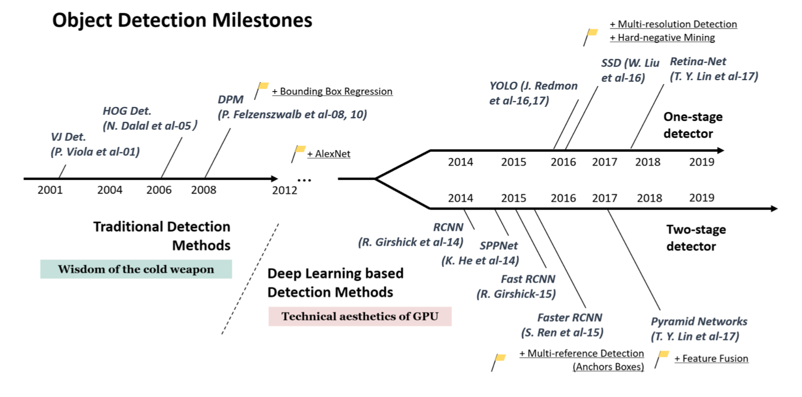

# [Object Detection Part 3a: Traditional Methods](#Object Detection Part 3a: Traditional Methods)

In this part, we will introduce three classical object detectors: *Viola-Jones Detector* (VJ Detector), *Histogram of Oriented Gradients* (HOG), and *Deformable Part Model* (DPM). Before deep learning methods gaining huge success on those perspective tasks, HOG and DPM with their extensions predominate detection challenges. For more details, *Zou et al., 2019* provides a detailed description of object detection in past two decades.

*Fig. 1. Timeline of the object detection milestones from 2001 to 2019 ([source]())*

The main idea of object detectors before deep learning is applying sliding window on locations and scales as many as possible of an image to find if there is an object in the window. To determine whether an object occurs in a region, binary classifiers are normally used to do object/non-object classification.

## [1. Viola-Jones Detector](#1. Viola-Jones Detector)

 [Viola-Jones(VJ) Detector (2001)]() was the first detector that achieved real-time face detection with a comparable accuracy without resorting to constraints like image differencing or skin color segmentation. VJ detector achieves comparable frame rate(15 fps) by working only with a single gray scale image. VJ detector as a milestone at early age has three main contributions. 

- **Feature representation**: *Integral image*. Unlikely previous pixel-based detectors working directly with image intensities, VJ detector applies the *integral image* to represent the features.

  - **Integral image**: The integral image at location $(x, y)$ contains the sum of the pixels above and to the left of $x$, $y$, inclusive: $ii(x,y)=\sum_{x^{'}\le x, y^{'}\le y}i(x^{'}, y^{'})$where $i(x, y)$ is the original image and $ii(x,y)$ is the integral image. Once computed, any one of the features can be computed at any scale or location in constant time. Thus, the computational complexity of each window is independent of the window size and only depends on values at four vertices.

    

    *Fig. 2. The sum within region D can be computed as 4 + 1 - (2 + 3). The value of integral image at location 1 is the sum of pixels in rectangle A. The value at location 2 is A + B, at location 3 is A + C, and at location 4 is A + B + C + D.*

  - **Rectangle features**: The feature of VJ detector are rectangle features as the following figure shows. VJ detevtor introduces three kinds of rectangle features with different number of rectangles. Each rectangle feature is the sum of the pixels which lie within the white rectangles subtracted from the sum of pixels in the grey rectangles. To calculate a two-rectangle features requires 8 vertices in total. Benefit from the adjacency, in VJ detector two-rectangle feature only requires 6 array references, three-rectangle feature requires 8 array references, and four-rectangle feature requires 9 array references.

    

    *Fig. 3. (A) and (B) are two-rectangle feature, where the feature is the difference between the sum of the pixels within two rectangle regions. (C) is a three-rectangle feature. (D) is a four-rectangle feature. The regions have the same size and shape and are horizontally or vertically adjacent.*

  - In contrast to steerable filters, which are good at the detailed analysis of boundaries, image compression, and texture analysis, rectangle features are more sensitive to the presence of edges, bars, and other simple image structure. 

- **Feature selection**: *Adaboost algorithm*. Instead of handcrafting features, VJ detector constructs a classifier using Adaboost to select a small number of informative features. Each classifier discards a vast majority of uninformed features like background and retain those promising features. The classifier selects a small set of features from an exhaustive set of random features (~180k-dimensional feature for a base resolution 24x24). 

  

  *Fig. 4. Two features shown in the top row selected by AdaBoost. The first feature measures the difference in intensity between the region of the eyes and a region across the upper cheeks. The feature capitalizes on the observation that the eye region is often darker than the cheeks. The second feature compares the intensities in the eye regions to the intensity across the bridge of the nose.*

- **Detection process**: *Detection cascades*. By compiling successively more complex classifiers in a cascade structure, the detector itself could focus on promising regions where object might occur. The overall detection process is essentially a *degenerate decision tree*, what is called "*cascade*". Each classifier predicts a positive or negative result. A positive result from former classifier triggers the evaluation of the next classifier which also adjusts the threshold to minimize false negatives while ordinary AdaBoost threshold is designed to yield a low error rate on training data. A negative result at any point leads to the immediate rejection of the sub-window. This is actually a multi-stage detection paradigm.

  

<i>Fig. 5. The detection cascade.</i>

## [2. HOG Feature Descriptor](###2. HOG Feature Descriptor)

[Histogram of oritented gradients (HOG)(2005)]() introduces an efficient feature extractor based on image gradient orientation. HOG detector uses a single fix-sized detection window to slide across an image. For each window, extract the feature from the regions in the window. The extracted features are fed to the SVM-based classifier to determine whether an object occurs. HOG and its extensions have long been important baseline of object detectors due to its outperformance.

Before moving to HOG, let's take a look at what is image gradient.

### Image Gradient

[Gradient](https://en.wikipedia.org/wiki/Gradient) is a multi-variable generalization of the derivative. Different from derivative as a scalar, gradient is a vector and has a direction pointing to the greatest rate of increase of a multi-variable function. Components of a gradient are partial derivatives with respect to all variables.

Image also has gradient. A gradient image are gradients of each pixel in the image. The [image gradient](https://en.wikipedia.org/wiki/Image_gradient) at each pixel is a 2-D gradient vector of a two-variable function which is a intensity function. Components of the 2-D gradient are the partial derivatives in the horizontal ($x$-axis) and vertical ($y$-axis) directions. Gradient at each pixel has two parts.

- **Direction**: points to the largest possible intensity increase direction, indicating the possible color change. It is mathematically calculated by the arctangent of the ratio between two partial derivatives and measured with degree (unsigned: 0~180, signed 0~360). 
- **Magnitude**: L2-norm of the gradient vector, which corresponds to the rate of change in that direction.

So, what can we do with the image gradient? Each pixel of a gradient image measures the change in intensity of that pixel in the original image. The magnitude of gradient is large around edges and corners where regions have abrupt intensity changes. This makes sense as we know edges and corners containing more object shape information than flat regions.

One common application of image gradient is [edge detection](https://en.wikipedia.org/wiki/Edge_detection). The pixels with the largest gradient values in the direction of the gradient become edge pixels, and edges may be traced in the direction perpendicular to the gradient direction. Gray pixels have a small gradient while black or white pixels have a large gradient.

<i></i>

*Fig. 6. The left one is the original image. The middle one is the gradient image meausring horizontal(x-axis) intensity change. The right one is the gradient image measuring the vertical(y-axis) intensity change. (Image source: [dogs-vs-cats datatset](https://www.kaggle.com/c/dogs-vs-cats/data) and [Yeezus by Kanye West](https://en.wikipedia.org/wiki/Yeezus))*

The definition of image gradient is aligned with gradients of a continuous multi-variable function. However, the intensity function of a digital image is only known at discrete points, derivatives of this function cannot be defined unless we assume that there is an underlying continuous intensity function which has been sampled at the image points. Plus several assumptions, the derivative of the continuous intensity can be computed as a function on the sampled intensity function. The most common way to approximate the image gradient is to convolve an image with a kernel, such as [Sobel operator](https://en.wikipedia.org/wiki/Sobel_filter) or [Prewitt operator](https://en.wikipedia.org/wiki/Prewitt_operator). 

### HOG as Feature

HOG as feature applies dense orientation sampling instead of coarse spatial sampling like shapes. It uses the distribution of gradient orientation in local portions of an image. HOG feature is computed on a dense grid of uniformly spaced *cells* and uses overlapping local contrast normalizations. 

- ***Cell***: Small connected spactial region (8 x 8 pixel cell in original paper) uniformly divided in an image. Each cell maintains a local 1-D histogram (distribution) of gradient directions accumulating over the pixels in the cell.

- ***Block***: Large spatial regions with group of adjacent cells (2 x 2 cells in a block in original paper). Local histograms of cells inside a block are concatenated into one block vector.

When detecting, tiling the detection window with a densely overlapping grid of HOG blocks. Separately normalize all the blocks in a detection window. These normalized block vectors are concatenated as the final feature vector. This is called *contrast normalization*, where each scalar cell response contributes several components to the final feature vector and each is normalized with respect to a different block. Contrast-normalizing the local responses is good for invariance to illumination and shadowing.

HOG captures characteristic local shape like edge or gradient structure by a local representation with an easily controllable degree of invariance to local geometric and photometric transformations. Besides, using distribution of orientations is more robust to noise.

### HOG Calculation

1. Calculate the gradients for each pixel. For a colored image, calculate gradients for each color channel separately, and take the one with the largest norm as the pixel's gradient.

   

   *Fig. 7. 8 x 8 cells grid image, arrows represent gradients (Image source: [link](https://www.learnopencv.com/histogram-of-oriented-gradients/))*

2. Uniformly divide the image into a grid of cells (cell size: 8 x 8 pixels). Then discretize each cell into angular bins according to the gradient orientation.

   The histogram is essentially a vector/array of 9 angular bins corresponding to the unsigned angle of gradient direction (0, 20, 40,...,160). Each pixel in one cell contributes weighted gradient to its corresponding angular bin. Empirical work shows unsigned gradients work better than signed gradients. This step efficiently reduce the 64-d vector (gradients in a cell) to a 9-d vector (histogram vector of a cell). The fundamental nonlinearity of HOG feature descriptor comes from this spatial/orientation binning step. 

   

   *Fig. 8. The upper figure shows the histogram of gradients are categorized into 9 angular bins. The middle figure shows a special case where gradient direction angle is greater than 160, let it contribute proportionally to both 0 degree bin and 160 degree bin. The lower figure is the final histogram of the 8 x 8 cell with 9 bins. (Image source: [link](https://www.learnopencv.com/histogram-of-oriented-gradients/))*

3. Block normalization(contrast-normalizing). A block window slides across the grid of cells with stride 1. In each block, histograms of 4 cells are concatenated into a 36-d vector, then normalize it with l2-norm. Normalized group of histograms represents the block histogram. 

   

   *Fig. 9. Block sliding with stride 1. (Image source: [link](https://www.learnopencv.com/histogram-of-oriented-gradients/))*

4. The final HOG feature of a detection window is a giant concatenated vector of all the normalized 36-d vectors from all the blocks in the window.

*Fig. 10. Overall HOG algorithm (Image source: [link](https://software.intel.com/en-us/ipp-dev-reference-histogram-of-oriented-gradients-hog-descriptor))*

## [3. Deformable Part Model](##Deformable Parts Model)

**Deformable Part Model** (DPM) (*Felzenszwalb et al., 2008*), originally proposed in 2008 later improved to several versions, have dominated the PASCAL VOC-07, -08, and -09 object detection challenges. Inspired by the part-based model ([Pictorial structures](https://www.cse.unr.edu/~bebis/CS773C/ObjectRecognition/Papers/Felzenswalb05.pdf)) and star-structured model, DPMs follows the philosophy of "divide-and-conquer" learning ensemble of detections on different object parts. In this article, we focus on the DPM introduced in *Felzenszwalb et al., 2010*.

*Fig. 11. Part-based model, pairs of parts are connected with springs. (Image source: [link](http://vision.stanford.edu/teaching/cs231b_spring1213/slides/dpm-slides-ross-girshick.pdf))*

DPMs are graphical models (Markov random fields) based on mixtures of multiscale models which decomposes an object into a collection of deformable parts. The deformable parts are designed to capture the local variable appearance while the deformable configuration is characterized by spring-like connections between certain pairs of parts. 

### DPM

*Fig. 12. An example of star-structured deformable part model. (Image source: [link](http://vision.stanford.edu/teaching/cs231b_spring1213/slides/dpm-slides-ross-girshick.pdf))*

A single DPM is a star-structured model containing three parts:

- A coarse ***root filter***: approximately covers an entire object which defines a detection window. A filter is a rectangular template defined by an array of $d$-dimensional weights vector.
- A set of finer ***part filters***: cover smaller parts of the object. The part filters capture features at twice the spatial resolution relative to the features in root filter level. 
- A ***spatial deformation model***: specifies deviation of deformable part from its ideal location relative to root for scoring the deformation cost. 

A ***score*** is defined to evaluate a star model at a particular position and scale in an image. The score, or response, of a filter at specific position in a feature map is the 'dot product' of the filter and a sub window of the feature map with same dimension at the same position. Score of a filter $F$ applied at position $p$ in feature pyramid $H$ is $F'\cdot \phi(H, p)$. $F'$is the flatten weights vector of $F$.

*Fig. 13. A DPM model of person. (a) a coarse root filter of person, (b) part filters at twice resolution relative to root filter, (c) a spatial model indicating deformation cost weights of the part filters. Putting the center of a part filter at different locations will yield different deformation cost.*

#### Modeling

DPM is parameterized by the appearance of each part (root and parts) and a geometric model capturing spatial relationships among parts. A model for an object with $n$ parts is formally defined by a $(n + 2)$-tuple, including all the filters and a bias term: $(F_0, P_1,...,P_n,b)$

- $F_0$: root filter
- $P_i$: $i$-th part filter
- $b$ : a real-valued bias term. The bias term is to make the scores of multiple models comparable when combined into a mixture model.

Each part model is defined by a 3-tuple, containing the corresponding filter, relative position, and deformation cost weights: $(F_i, \mathbf{v_i}, \mathbf{d_i})$ 

- $F_i$: a filter for the $i$-th part
- $\mathbf{v_i}$: a 2-d vector, specifying an "*anchor*" position for part $i$ relative to the root position
- $\mathbf{d_i}$: a 4-d vector, specifying coefficients of a quadratic function, which defines a deformation cost for each possible placement of the part relative to the anchor position. In general, the deformation cost is an arbitrary separable quadratic function of the displacements.  e.g. $\mathbf{d_i} = (0, 0, 1, 1)$ means the deformation cost for the $i$-th part is the squared distance between its actual position and its anchor position relative to the root.  

An *object hypothesis* specifies the location of each filter in a feature pyramid, $z = (p_0,...,p_n)$ where $p_i=(x_i, y_i, l_i)$ specifies the level and position of $i$-th filter. 

The score of a hypothesis is defined by substracting deformation costs from the summation of scores of all the filters, then plus the bias. The deformation costs of parts capture the geometry configuration of the part filters.

**score = all filters scores - deformation costs + bias**

 $score(p_0,...,p_n) =\sum^{n}_{i=0}F'_i\cdot\phi(H,p_i)-\sum^{n}_{i=1}\mathbf{d_i}\cdot\phi(dx_i, dy_i) + b$

- $F'_i$: Flatten weights vector of filter $i$
- $\phi(H,p_i)$: feature vector at position $p_i$ on feature map 
- $(dx_i, dy_i)$: *Displacement* of the $i$-th part relative to its anchor position$(dx_i, dy_i)=(x_i,y_i)-(2(x_0,y_0)+v_i)$
- *Deformation features*: $\phi(dx_i, dy_i) =(dx,dy,dx^2,dy^2)$ 

The hypothesis $z$ score could be simplified to a dot product between model parameters $\beta$ and a vector concatenating all hypothesis configuration:

$score(\beta,H,z)=\beta\cdot \psi(H,z)$
- Model parameters: $\beta = (F'_0,...,F'_n,d_1,...,d_n,b)$
- Hypothesis configuration: $\beta\cdot \psi(H,z)=(\phi(H,p_0), ...,\phi(H,p_n),-\phi(dx_1,dy_1),...,-\phi(dx_n,dy_n), 1)$

This is actually a linear parameterization of the hypothesis $z$ score. 

DPM uses a discriminative training methods to optimize the parameters by minimizing the detection mistakes and optimizing the decision boundary between positive and negative examples.

#### Matching

DPM uses a dense set of possible positions and scales in an image, and defines a score for placing a filter at each of these locations. When detect objects in an image, compute an overall score for each root filter according to the best possible placement of the parts:

$score(p_0) =max_{p1,...,p_n}score(p_0,...,p_n)$

$score(p_0)=max_{p_1,...,p_n}(\sum^{n}_{i=0}\mathbf{w_i}\cdot\phi(p_i) -\sum^{n}_{i=1}\mathbf{d_i}\cdot(dx,dy,dx^2,dy^2))=max_z\mathbf{w}\cdot\Phi(z)$

The root location yielding the highest score highly possiblely has an object and the locations of the parts that yield the high-scoring root location define a full object hypothesis.

### Mixture Models

Mixture models apply ensemble DPMs to model an object category. A mixture model structure contains a number of components, number of parts of each component, shapes of the root and part filters, and locations of part anchor.

*Fig. 14. An example of deformations mixture models to represent an object category. Two star models represent (near) frontal and sideway view of a bicycle model.* 

A mixture model with $m$ components is defined by a $m$-tuple, $M=(M_1,...,M_m)$, where $M_c$ is the model for the $c$-th component. 

An object hypothesis for a mixture model specifies a mixture component and a location for each filter of $M_c$, $z=(c, p_0,...,p_{n_c})$, where $n_c$ is the number of parts in $M_c$. The score of this hypothesis is the score of the hypothesis $z'=(p_0,...,p_{n_c})$ for the $c$-th model component. 

Parameters required to be learned include biases of each component, deformation costs of each part, and the filter weights. However, one challenge of DPM training is the weakly labelled data since there are no bounding boxes specifying the component labels or part locations. DPM trained a latent SVM with coordinate descent approach. As the coordinate descent algorithm is suceptible to local minima thus sensitive to initialization, DPM uses a trained HOG detector parameters as initialization for root filters and interpolation the root filter to twice the spatial resolution as part filters initialization.

*Fig. 15. Visualization of DPM inference process.*

### DPM Feature

To model objects at different scales, DPM introduces image pyramid and feature pyramid. By repeated smoothing and subsampling, a standard *image pyramid* is computed. Then, compute a feature map from each level of the image pyramid. A *Feature pyramid* specifies a feature map for a finite number of scales in a fixed range.  

*Fig. 16. A feature pyramid and an instantiation of a person model within that pyramid.*

DPM explores several HOG-based features. 

- It starts from original 36-dimensional HOG features.
- Compute 11-D feature by appling [Principal component analysis (PCA)](https://en.wikipedia.org/wiki/Principal_component_analysis) on 36-D HOG feature. The eigenvalues indicate that the linear subspace spanned by the top 11 eigenvectors captures essentially all the information in a HOG feature. This lower dimensional feature leads to fewer parameters and speeds up the detection and learning process. However, it adds the projection cost.
- Consider 36-D HOG feature vector as a 4x9 matrix. Define a 13-D feature by concatenating 4-D vector summing over the 4 normalization for a fixed orientation and 9-D vector summing over 9 orientations for a fixed normalization. It's observed that 13-D features have same performance with 11-D PCA features. However, 13-D features are less costly than performing PCA. Moreover, 13-D feature has simpler interpretability as 4 gradient energy features and 9 orientation features.
- Augment the 13-D feature to include both contrast sensitive and contrast insensitive features as a 31-D feature vector. It turns out that the augmented feature improves the performance for most classes of the PASCAL datasets. In the 31-D feature vector, 27 dimensions corresponding to different orientation channels (9 contrast insensitive as original HOG and 18 contrast sensitive), and 4 dimesions capturing the overall gradient energy in a block of four cells.
- The top eigenvectors obtained by PCA can be roughly interpreted as a two-dimensional separable Fourier basis. Each eigenvector can be viewed as a sine or cosine function of one variable. Thus, features could be defined by using a finite number of Fourier basis functions instead of a finite number of discrete orientations.

### Hard Negative Mining

One challenge of object detection is the huge number of negative examples (a single image can yield 500M~1B) are generated during training process such as background noise. It's inefficient and infeasible to learn on every negative example. The imbalance of positive and negative examples might raise bias of the detector to the negative examples. Therefore, it's common to find a way to eliminate the majority of negative examples but retain the hard negative examples. Hard negative examples are false negative instances, where negative instance are incorrectly recognized as positive. More commonly, people use data mining methods, which called hard negative mining, like *bootstrapping* to train a model to collect negative examples, then combine the positive examples and a reasonable number of negative examples plus the hard negative examples as the training data for the detector. 

### Bounding Box Regression

Previous versions of DPM directly derive the bounding box from the root filter locations. Yet DPM actually localizes each part filter and the part filters contain greater spatial precision than root filters. The latest DPM introduces a method, bounding box regression, to predict the bounding box directly with the detector output. 

Bounding box regression uses the complete configuration of an object hypothesis $z$ mapping a feature vector $g(z)$ to the upper-left, $(x_1, y_1)$, and lower-right, $(x_2, y_2)$, corners of the bounding box with  functions. For a model with n parts, $g(z)$ is a $2n+3$ dimensional vector containing the width of the root filter and the location of the upper-left corner of each filter. By linear least-squares regression, learning four linear functions by the output of the detector on each instance for predicting $x_1$, $y_1$, $x_2$, and $y_2$ from $g(z)$.

*Fig. 17. An example of bounding box regression for a car detection.*

### Non-Maximum Suppression

After matching, multiple overlapping detections for each instance of an object are generated. To reduce the redundancy and improve the efficiency, non-maximum suppression is used to greedily eliminate repeated detections. Bounding box prediction process will generate a set of detections for a particular object category and each detection is associated with a bounding box and a score. The non-maximum suppression will greedily select the highest scoring detections and skip boxes that overlap with previously selected detection over a threshold, in DPM 50%.

### Contextual Information

The authors of DPM implement a rescoring procedure on detections which introduces the contextual information in an image. For a set of detections obtained using $k$ different models (for different object categories) in an image $I$. To rescore a detection $(B,s)$, $B$ is the predicted bounding box, build a 25-D feature vetor:

$g=(\sigma(s), x_1,y_1,x_2,y_2,c(I))$   

- $\sigma(s)$: $\sigma(s) = \frac{1}{(1+exp(-2s))}$ is a logistic function for renormalizing the scores
- $x_1$, $x_2$, $y_1$, $y_2$: the top-left and bottom right bounding box coordinates, coordinates are normalized by the width and height of the image. 
- $c(I)$: context of image $I$, $c(I)=(\sigma(s_1),..., \sigma(s_k))$, where $s_i$ is the score of the highest scoring detection of $D_i$

Use a category-specific classifier to score the vector $g$ for rescoring. The classifier is trained to distinguish correct detections from false positives by integrating contextual information defined by $g$. Each detection returned by one of our models leads to an example $g$ that is labeled as a true positive or false positive detection. The rescoring procedure improve the performance significantly on several categories.

## Reference

[1] Zhengxia Zou, Zhenwei Shi, Yuhong Guo, Jieping Ye,(2019). Object Detection in 20 Years: A Survey

[2] Viola, P., & Jones, M. (2001). Rapid object detection using a boosted cascade of simple features. *Proceedings of the IEEE Computer Society Conference on Computer Vision and Pattern Recognition*, *1*.m

[3] Dalal, N., & Triggs, B. (2005). Histograms of oriented gradients for human detection. *Proceedings - 2005 IEEE Computer Society Conference on Computer Vision and Pattern Recognition, CVPR 2005*, *I*, 886–893. 

[4] Kumar, M. P., Torr, P. H. S., & Zisserman, A. (2005). Extending pictorial structures for object recognition. *Technical Paper - Society of Manufacturing Engineers*, *TP05PUB1*.

[5] Felzenszwalb, P., McAllester, D., & Ramanan, D. (2008). A discriminatively trained, multiscale, deformable part model. *26th IEEE Conference on Computer Vision and Pattern Recognition, CVPR*.

[6] Felzenszwalb, P., Girshick, R., McAllester, D. and Ramanan, D. (2010). Object Detection with Discriminatively Trained Part-Based Models. *IEEE Transactions on Pattern Analysis and Machine Intelligence*, 32(9), pp.1627-1645.