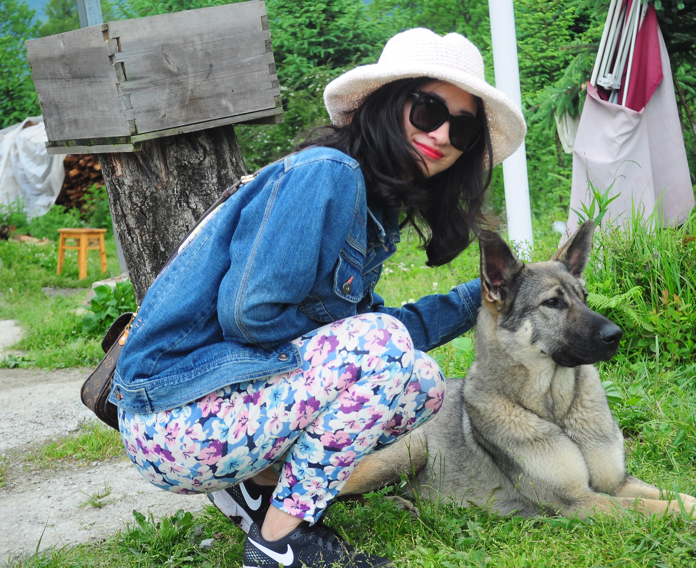

## About Me

Hi! I am a second-year graduate student in Information Technology at Carnegie Mellon University. Before CMU, I got a B.Sc. in Engineering from Renmin University of China, where I majored in Information Systems and Management. 

I have wide interest in natural language processing tasks. More specificly, I'm interested in building machine learning and deep learning models to understand human language. 

## Contact

* Email: hangz1@andrew.cmu.edu
* Github: [@hsparrow](<https://github.com/hsparrow>)
* Twitter: [@hsparrow](<https://twitter.com/hsparrow6>)